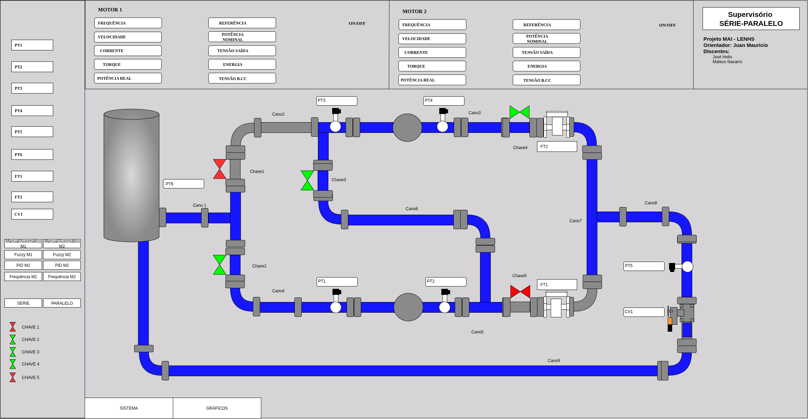

# Minicurso SCADA-LTS

Este repositório contém todos os materiais utilizados no minicurso de introdução ao SCADA-LTS, incluindo tutoriais em PDF, arquivos de exemplo e um template pronto para a criação de um supervisório.

Minicurso desenvolvido por **Mateus Navarro Ribeiro de Lima**, graduando no curso de **Engenharia Elétrica da Universidade Federal da Paraíba** com orientação do professor **Juan Mauricio Villanueva**

## 📘 Conteúdo do Curso

- Introdução ao SCADA-LTS
- Instalação e configuração
- Criação de Data Sources e Data points, com comunicação MODBUS (uso de um simulador)
- Criação de telas supervisórias
- Projeto final: desenvolvimento de um supervisório completo interativo com auxílio de scripts

## 📂 Estrutura do Repositório

| Pasta                    | Descrição                                                                     |
| ------------------------ | ----------------------------------------------------------------------------- |
| `Dia 1/`                 | PDFs e Arquivos referentes ao primeiro dia do curso                           |
| `Dia 2/`                 | PDFs e Arquivos referentes ao segundo dia do curso                            |
| `Simulador Modbus/`      | Programas de simulação da comunicação MODBUS para a realização dos exercicios |
| `Tutorial de Instalação` | Tutoriais de instalação do programa para Windows e Linux                      |

## 🖼️ Exemplo de Supervisório

## 

---

## 💻 Requisitos

- SCADA-LTS
- Java Runtime
- Simulador MODBUS (arquivos no próprio repositório)

---

## 📧 Contato

Para dúvidas ou sugestões, entre em contato pelo e-mail: `mateus.lima@estudante.cear.ufpb.br`
