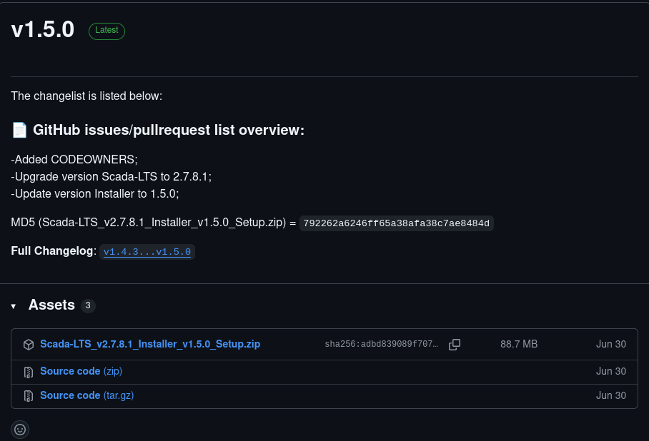
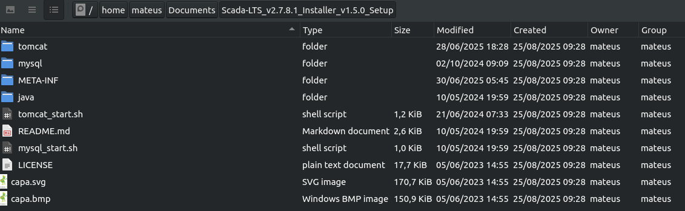
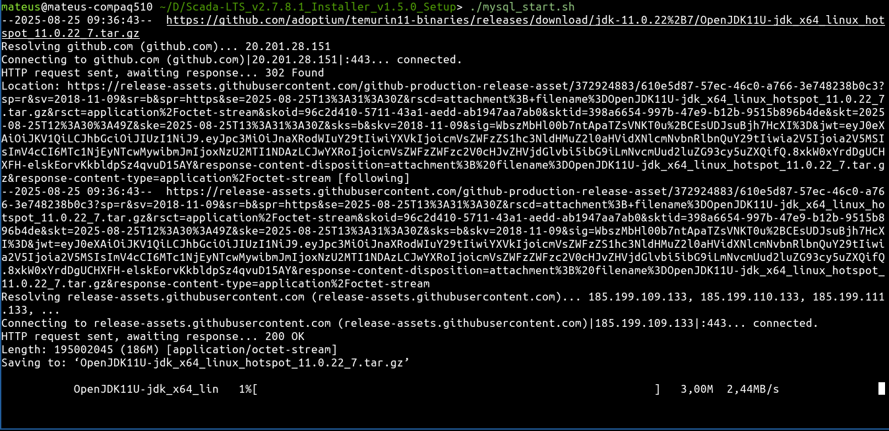
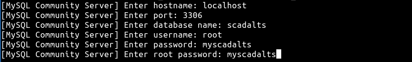
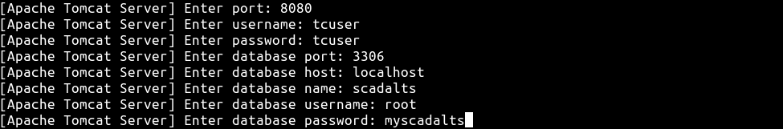

# 📥 Instalação do SCADA-LTS no Linux

Este tutorial descreve o passo a passo para instalar o **SCADA-LTS** no Linux.

---

##  1 - Pré-requisitos

- Qualquer distribuição Linux, a utilizada foi a **Lubuntu 22.04.5 LTS**

------

##  2 - Download do SCADA-LTS

1. Acesse o site oficial do SCADA-LTS para as instalações Linux: [https://github.com/SCADA-LTS/linux-installer/releases](https://github.com/SCADA-LTS/linux-installer/releases)
2. Baixe a versão disponibilizada no repositório (a versão testada e utilizada no curso será a **2.7.8.1**)

3 - As versões em Linux são instaladas de forma local, sendo permitido ao usuário multiplas versões do SCADA LTS em um mesmo dispositivo. Por conta disso, extraia o arquivo baixado em uma pasta de sua preferência.

------

##  3 - Instalação e Configuração do MySQL

1 - O MySQL será responsável pela configuração do banco de dados do SCADA LTS, na pasta extraida, procure o arquivo chamado **mysql_start.sh**, permita a execução desse arquivo pelo sistema (esse passo varia de distribuição por distribuição, no lubuntu é possivel clicar com o botão direito no arquivo e na janela de propriedades confirmar se o arquivo é confiável)

2 - Execute com o seguinte comando no terminal para começar a configuração do MySQL e aguarde um momento

3 - Após isso, será necessário preencher algumas informações que são pedidas pelo instalador, como o tutorial será feito em uma maquina local, siga esses comandos na ordem

4 - Quando o ultimo comando mostrado no terminal for "Pronto para conexões", deixe o terminal aberto e siga para o próximo passo

------

## 4 - Instalação e Configuração do Tomcat

1 - Com o terminal da instalação do MySQL **ABERTO**, abra outro e prossiga a próxima instalação

2 - O Tomcat será responsável pela configuração da aplicação web do SCADA LTS, na pasta extraida, procure o arquivo chamado **tomcat_start.sh**, permita a execução desse arquivo pelo sistema (esse passo varia de distribuição por distribuição, no lubuntu é possivel clicar com o botão direito no arquivo e na janela de propriedades confirmar se o arquivo é confiável)

3 - Execute com o seguinte comando no terminal para começar a configuração do Tomcat e aguarde um momento

3 - Após isso, será necessário preencher algumas informações que são pedidas pelo instalador, como o tutorial será feito em uma maquina local, siga esses comandos na ordem

------

- Após a instalação, com os dois terminais aberto, a aplicação no SCADA LTS já está funcionando, para acessar, use qualquer navegador com a url http://localhost:8080/Scada-LTS/.
- No Linux, para fechar a aplicação, basta encerrar os dois terminais abertos. Para uma nova inicialização, inicie na sequência, o **mysql_start.sh** e depois o **tomcat_start.sh**.

