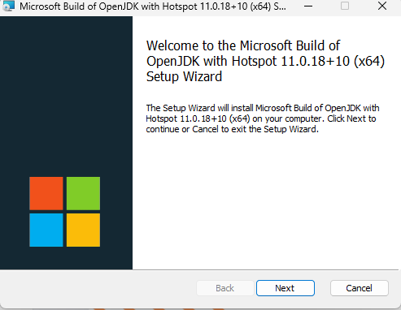
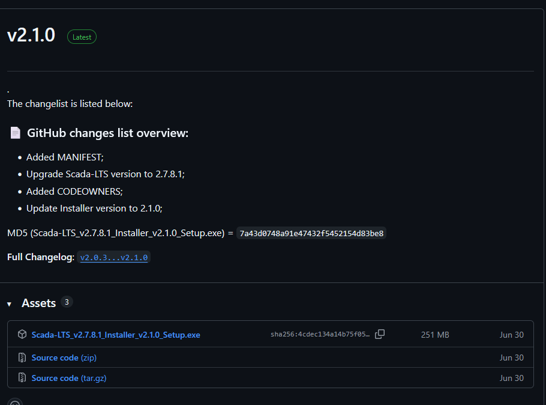
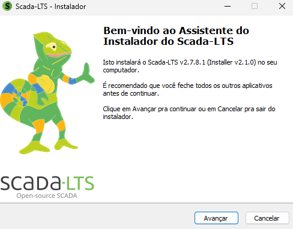
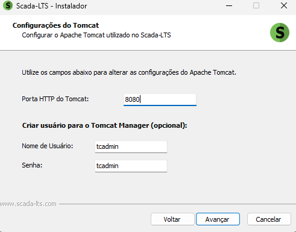
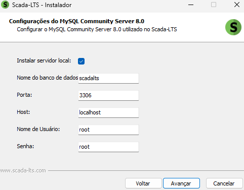

# 📥 Instalação do SCADA-LTS no Windows

Este tutorial descreve o passo a passo para instalar o **SCADA-LTS** no Windows.

---

##  1 - Pré-requisitos

- Sistema operacional: Windows 10 ou 11
- [Java Development Kit (JDK))](https://aka.ms/download-jdk/microsoft-jdk-11.0.18-windows-x64.msi) instalado
- Necessário estar utilizando o usuário Administrador

---

## 2 - Instalação JDK

1 - Baixe o Java Development Kit disponibilizado acima
2 - Execute e siga os passos clicando em "Next", conforme a figura abaixo:

3 - SIga a atualização até essa janela, marque para instalar no disco local a opção referente a **"Set JAVA_HOME variable"**  conforme a figura abaixo:

------

##  3 - Download do SCADA-LTS

1. Acesse o site oficial do SCADA-LTS: [https://github.com/SCADA-LTS/windows-installer/releases](https://github.com/SCADA-LTS/windows-installer/releases)
2. Baixe a versão disponibilizada no repositório (a versão testada e utilizada no curso será a **2.7.8.1**)

3 - Execute o arquivo siga a instalação normalmente.

4 - Na página de configuração do Tomcat durante a instalação, deixe da seguinte forma:

5 - Na página de configuração do MySQL Server, marque a opção de instalar em um servidor local, a configuração ficará dessa forma:

6 - Após a instalação, na área de trabalho será criado três atalhos, dois para ligar e desligar o servidor SCADA e o atalho para abrir a interface do SCADA. Porém, o link por padrão no navegador é **https://localhost:8080/Scada-LTS**

------

